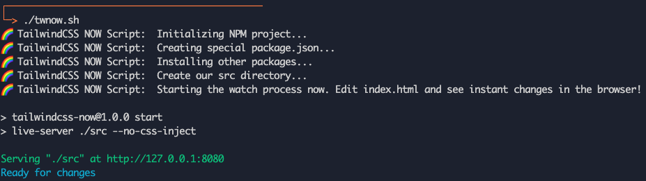

# 🌈  Tailwind Now Script

> A little bash script to get you started experimenting with TailwindCSS now!

## Getting Started

1. Run `./twnow.sh`
2. Edit your `src/index.html` to see instant changes!

## How It Works

* The bash script writes out all the files you need in one go - writes files, starts server to watch live changes:
  * `package.json` with NPM scripts
    * `npm run start` which serves and then opens the page for you at [http://127.0.0.1:8080/](http://127.0.0.1:8080/)
    * `npm run serve` which watches your changes with [live-server](https://github.com/compodoc/live-server)
  * `index.html` file with TailwindCSS lib via CDN, and config embedded in the HTML
